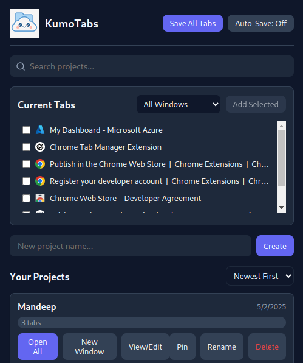

# 🌥️ KumoTabs
**KumoTabs** is a minimal,  Chrome extension that lets you manage your browser tabs in a clean and organized way. It's currently a simple tab manager with plans to grow into a more feature-rich productivity tool.

 

🌐 Install on Chrome (Manually)
Open Google Chrome

Go to chrome://extensions/

Enable Developer mode (toggle at the top right)

Click "Load unpacked"

Select the folder where you cloned or unzipped KumoTabs
